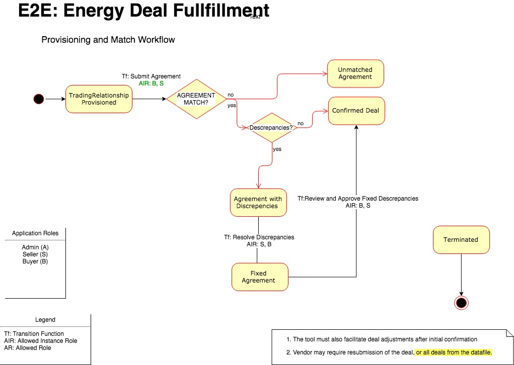

E2E Energy Trading Application 
==================================================================

Overview 
---------

The E2E Energy Trading Application expresses a workflow of

The E2E Energy Trading Application enables post-deal execution, records bilateral physical natural gas trades and facilitates specified processes across the transaction lifecycle.

Data and processes will be recorded to a private blockchain network to ensure integrity. E2E seeks a thoughtful solution which ensures data security throughout. Confidentiality is also a key element, only the two parties of the deal, and potentially an administrator, be aware of the trade details. We look for a Vendor to provide a solution which facilitates both the security and confidentiality.

The E2E-ET application delivers solutions to cover four scenarios
* Deal confirmation
* Price Adjustments
* Volume Adjustments
* Calculate Payment Amounts

Deal Confirmation
-----------------

Bilateral trading partners negotiate an agreement that is comprised of one or more deals.  Each party is responsible to record the details of all the deals included in the agreement and to submit these agreements to the E2E-ET platform.  (Need interface for trading parties to submit agreements)

Trading parties need to be provisioned and bound together to enable them to record and manage their bilateral trading agreements with each other.

Once provisioned, parties can submit agreements for matching and verification.

Agreements are released for fullfillment when all deals matched, verified and approved.  Any descrepancies in a deal need to be resolved and agreed by the parties before an agreement is released for fullfillment, or, the deal can be removed from the Agreement and resubmitted as part of a new Agreement. 

Deals in an Agreement can be adjusted after it is released for fullfillment with both parties approval

Application Roles 
------------------

| Name       | Description     |
|------------|-----------------------------------------------------------------------------------------------------|                                  
| Seller     | A person that represents the entity that owns the asset that is being sold per the terms of an Agreement.  A  person in a seller role can be a part of one or more trading partner bindings, in that can be paired with more than one buyer through multiple trading partner bindings (one smart contract for each pair).  |
| Buyer      | A person that represents the entity that is buying the asset that is being sold per the terms of an Agreement.  A  person in a buyer role can be a part of one or more trading partner bindings, in that can be paired with more than one seller through multiple trading partner bindings (one smart contract for each pair).  |
| Admin     | A person that helps to administer agreements|

Workflow States 
--------------

Matching
--------

| Name                 | Description                                                                                                 |
|----------------------|-------------------------------------------------------------------------------------------------------------|
| TradingRelationshipProvisioned               | Indicates that a Seller and Buyer have been provisioned and able to record agreements.    |                           | AgreementOpened         | Agreement has been opened |  
| AgreementActive         | Agreement has been approved and released for fullfillment|  
| AgreementRevoked         | Agreement has been revoked including all unfullfilled deals |                          
| DealMatched         | Deal that  been matched to the Deal received from the counterparty   |
| DealWithDiscrepancies        | Deal that  been matched to the Deal received from the other party of the Deal  but has Discrepancies |

Post-Delivery Volume Adjustments  
-------

| Name                 | Description                                                                                                 |
|----------------------|-------------------------------------------------------------------------------------------------------------|
| VolumeAdjustmentNeeded              | volumes delivered do not match agreed terms.                                                      |
| VolumeAdjustmentApproved         | Indicates that buyer has approved the adjustment.   |

Workflow Details
----------------

Application Files
-----------------
